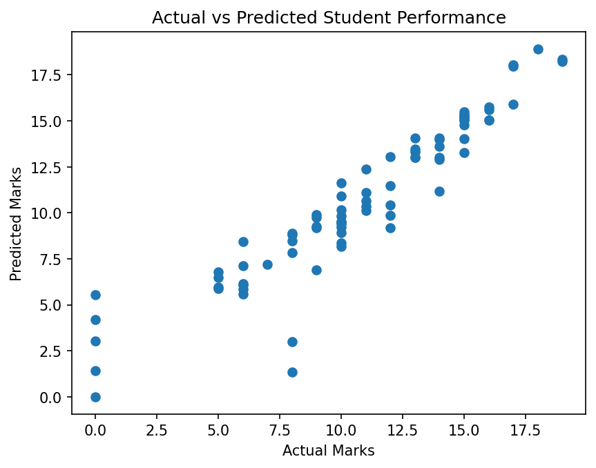
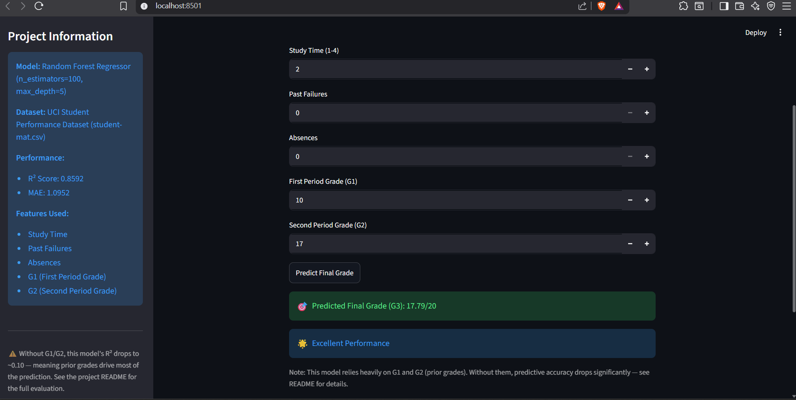

# 🎓 Student Performance Predictor

An end-to-end Machine Learning project that predicts a student's final
academic grade (G3) using a Random Forest Regressor, deployed as an
interactive Streamlit web app.

---

## Problem

Schools and tutors often want early signals of which students may need
extra support. This project explores whether a student's final grade
can be predicted from study habits, attendance, and prior performance.

---

## Dataset

UCI Student Performance Dataset (`student-mat.csv`) — Portuguese secondary
school students, including demographic, academic, and lifestyle attributes.

---

## Approach

Two models were trained and compared:

| Model | MAE | R² |
|---|---|---|
| Linear Regression | 1.34 | 0.78 |
| **Random Forest Regressor** | **1.05** | **0.87** |

Random Forest was selected as the final model after hyperparameter tuning
(`n_estimators=100`, `max_depth=5`, selected via 5-fold cross-validation).

**Features used:** Study Time, Past Failures, Absences, G1 (first period
grade), G2 (second period grade).

---

## Results

**Final Model Performance (test set):**
- R² Score: 0.8592
- MAE: 1.0952



Most predictions track closely with actual grades, particularly for
mid-to-high performers (8–16 range). The model is less reliable at the
extremes — students with very low actual grades (near 0) are sometimes
over-predicted.

---

## ⚠️ Limitations — The G1/G2 Honesty Check

A common criticism of this dataset: G1 and G2 are prior-period grades,
not lifestyle factors. To test how much they drive the result, a second
model was trained using **only** Study Time, Failures, and Absences:

| Model Version | R² | MAE |
|---|---|---|
| With G1, G2 | 0.8592 | 1.0952 |
| **Without G1, G2** | **0.1032** | **3.4223** |

This is the most important finding of this project: **G1 and G2 account
for the vast majority of this model's predictive power.** Without them,
study time/failures/absences alone explain very little of the variation
in final grades.

In practice, this model is better understood as a **grade trend
extrapolator** (estimating G3 from prior academic trajectory) rather
than a model that predicts outcomes purely from lifestyle habits.

---

## Tech Stack

Python · Pandas · NumPy · Scikit-Learn · Streamlit · Joblib

---

## Project Structure
StudentPerformancePredictor_Final/

├── Dataset/

├── Model/

├── src/

│   ├── data_preprocessing.py

│   ├── train_model.py

│   ├── evaluate.py

│   └── main.py

├── StudentPerformancePredictor_Final.ipynb

├── app.py

├── requirements.txt

└── README.md

---

## App Preview



## How to Run Locally

```bash
git clone https://github.com/mukundan1012-creator/StudentPerformancePredictor_Final.git
cd StudentPerformancePredictor_Final
pip install -r requirements.txt
streamlit run app.py
```

To retrain the models from scratch:
```bash
cd src
python main.py
```

---

## If I Rebuilt This Today

I would test additional engineered features (e.g., parental education,
weekly alcohol consumption) on the no-grades model to see if the R² gap
can be narrowed, and add a feature-importance plot to visualize exactly
how much weight G1/G2 carry relative to other inputs.

---

## Author

**Mukundan D**
B.E. Electronics and Communication Engineering